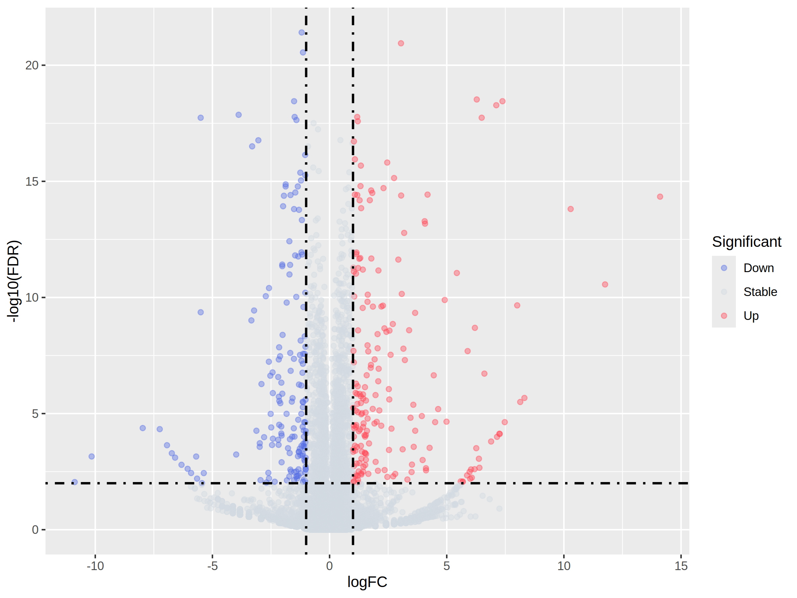

# 資料視覺化: 火山圖

在前面 *6.差異表現量統計* 中，我們計算出量化每個基因表現並利用統計模型計算差異表現，同時得出 p-value 和 FDR。現在我們將透過火山圖的方式呈現這些結果。火山圖以 x 軸表示實驗組與對照組表現量的比值 (以 log2 形式表示)。因此 x 軸數值的增加代表相對表現量提高，而減少則代表相對表現量越低。y 軸則表示 -logFDR，數值越大，表示結果的顯著性越高。

我們將使用 R 語言中的 ggplot2 套件來繪製火山圖。我們選擇 ggplot2 是因為它是個強大的圖表繪製工具。學會此工具後可以應用在很多地方。

## 快速上手

### 安裝 ggplot2 與 ggrepel 套件
```R
# Install and load necessary packages
install.packages("ggplot2")
install.packages("ggrepel")
```

### 載入套件
```R
library(ggplot2)
library(ggrepel)
```

### 檔案輸入

取讀在 *6.差異表現量統計* 中利用 edgeR 產生差異表現表格 (以 "DEG.txt" 為例) 並且存入 dataset 這個陣列 (dataframe)。請依實際狀況修改檔案路徑。
```R
# Read DEG table
dataset <- read.delim("DEG.txt", header=TRUE)

# 選擇性：在本例中，基因名稱以 "geneABC|geneABC" 顯示，這樣子的易讀性較差。因此，我使用下面的指令將基因名稱調整為 geneABC 形式
dataset$X <- gsub("\\|.*", "", dataset$X)
```
使用 `header=TRUE` 選項，將第一列標頭資訊沿用至這個陣列的標題。 

快速檢視檔案
```R
head(dataset)
```

部份輸出
```
              X      logFC     logCPM          F       PValue         FDR
1        CR11023 -1.7615747 -0.2668405  2.6323467 0.1280841680 0.396309525
2          Ir21a -0.3918988  0.2778043  0.1592887 0.6961258115 1.000000000
3           Cda5 -0.2150723  1.2397431  0.3519258 0.5629449021 0.953883311
```
我們將會使用 logFC 欄以及 FDR 欄的數值來繪製圖表

### 繪製基本火山圖

ggplot 語法分兩個部份，第一個函式 `ggplot(dataset, aes(x = logFC, y = -log10(FDR)))` 是繪製底圖，並且宣告資料來源 (dataset)，x 值來源 (欄名 logFC)，y 值來源 (欄名 FDR，並以 -log10 表示)。再來以 `+` 符號連接第二個函式。第二函式決定數值以什麼形式表現。本例為點圖表示 `geom_point()`。除了點圖之外，ggplot 還可以繪製長條圖 (`geom_bar`)、熱圖 (`geom_tile`) 等等圖表。
```R
ggplot(dataset, aes(x = logFC, y = -log10(FDR))) +
    geom_point()

# 儲存基本火山圖
ggsave("volcano_basic.png", width = 8, height = 6, units = "in", dpi = 300)
```


## 渲染火山圖

雖然說基本火山圖已經足以表達。但是黑壓壓一片，在視覺上仍不夠直觀。ggplot2 支援多重函式來渲染。使得圖表更容易被閱讀。

### 添加水平與垂直線

大多數差異基因分析的首要任務就是找出顯著表現基因。在此我們可以在圖表中添加水平線與垂直線來標示 FDR < 0.01 及相對表現大於 2 倍。

參數設定。在這個例子中，我將 FDR 0.01 與相對表現量 2 倍差異作為顯著門檻。
```R
# Set cutoff
cut_off_pvalue = 1E-2
cut_off_logFC = 1
```

我們添加垂直線 `geom_vline` 與水平線 `geom_hline`函數來渲染。在垂直線中，我們把線設置在 x=-1 以及 x=1 的位置上 (xintercept=c(-1,1))，第四號線 (lty=4 即為虛線)，黑色 (col="black")，線段寬度 0.8 (lwd=0.8)。相同概念設置水平線。

此外，我們把點圖並且設置為 40% 透明度 (alpha=0.4)，才不會讓畫面太沈重。
```R
ggplot(dataset, aes(x = logFC, y = -log10(FDR))) +
    geom_point(alpha=0.4) + 
    geom_vline(xintercept=c(-cut_off_logFC,cut_off_logFC),lty=4,col="black",lwd=0.8) +
    geom_hline(yintercept = -log10(cut_off_pvalue),lty=4,col="black",lwd=0.8)

# 儲存火山圖
ggsave("volcano_lines.png", width = 8, height = 6, units = "in", dpi = 300)
```


### 依照相對表現量改變資料點的顏色

現在我們更進階一點。我們把顯著增加或減少的點渲染成紅色或是藍色，不顯著的點渲染低視度顏色。在此，我們定義顯著增加資料點為 FDR < 0.01 且 logFc > 2; 顯著減少的資料點為 FDR < 0.01 且 logFc < -2。

我們在新的欄位 Significant 註記該基因是否為顯著表現或是持平。此為巢狀判斷式，先判斷是否顯著，若不顯著則判斷為持平。若為顯著，則判斷是否為顯著增加表現。
```R
# Label change Two layers of ifelse loop. First, if significant; second, if up regulated
dataset$Significant = ifelse(dataset$FDR < cut_off_pvalue & abs(dataset$logFC) >= cut_off_logFC, 
                               ifelse(dataset$logFC > cut_off_logFC ,'Up','Down'),
                               'Stable')
```

在 `geom_point` 函式中，添加 `aes(colour=Significant)`，代表資料點的顏色將會依據 `Significant`   欄位值的不同而所變化。我們又添加 `scale_color_manual` 來手動指定三種顏色。分別是藍色、灰色、紅色
```R
ggplot(dataset, aes(x = logFC, y = -log10(FDR))) +
    geom_point(aes(colour=Significant), alpha=0.4) + 
    scale_color_manual(values=c("#546de5", "#d2dae2","#ff4757")) +
    geom_vline(xintercept=c(-cut_off_logFC,cut_off_logFC),lty=4,col="black",lwd=0.8) +
    geom_hline(yintercept = -log10(cut_off_pvalue),lty=4,col="black",lwd=0.8)

# 儲存火山圖
ggsave("volcano_colordot.png", width = 8, height = 6, units = "in", dpi = 300)
```



### 標籤非常顯著的基因名稱 (選擇性)

我們可以發現有幾個離散的資料點。我們好奇，到底是哪些基因有如此大且顯著的表現。為了達成此目的，我們使用 `geom_text_repel` 函數來標籤這些非常顯著的資料點。在此，我們挑出 FDR < 10^-5 且 512 倍增加(或減少) 的資料進行標記 (`data = subset(dataset, FDR < 1E-5 & abs(dataset$logFC) >= 5)`)。標記的內容則從 X 欄位 (即基因名稱) 獲取 (`aes(label = X)`)。我們還可以微調大小、距離、標線等等參數 (`size = 5, box.padding = unit(0.5, "lines"), point.padding = unit(0.3, "lines"))`)

此外，為了讓資料看起來更專業，我們使用 `labs` 函數添加標題、x 軸、y 軸名稱。依照需求調整圖標的位置 `theme(legend.position = "bottom")`
```R
# Plotting
ggplot(
    # data, color
    dataset, aes(x = logFC, y = -log10(FDR))) +
    geom_point(aes(colour=Significant),alpha=0.4) +
    scale_color_manual(values=c("#546de5", "#d2dae2","#ff4757"))+
    # Label very significant genes
    geom_text_repel(
      data = subset(dataset, FDR < 1E-5 & abs(dataset$logFC) >= 5),
      aes(label = X),
      size = 3,
      box.padding = unit(0.5, "lines"),
      point.padding = unit(0.3, "lines"))+
    # line
    geom_vline(xintercept=c(-1,1),lty=4,col="black",lwd=0.8) +
    geom_hline(yintercept = -log10(cut_off_pvalue),lty=4,col="black",lwd=0.8) +
    # axis
    labs(title = "Volcano plot",
         x="log2(fold change)",
         y="-log10 (FDR)")+
    # Figure legend  
    theme(legend.position = "bottom")

# export the result
ggsave("volcano_final.png", width = 8, height = 6, units = "in", dpi = 300)
```
