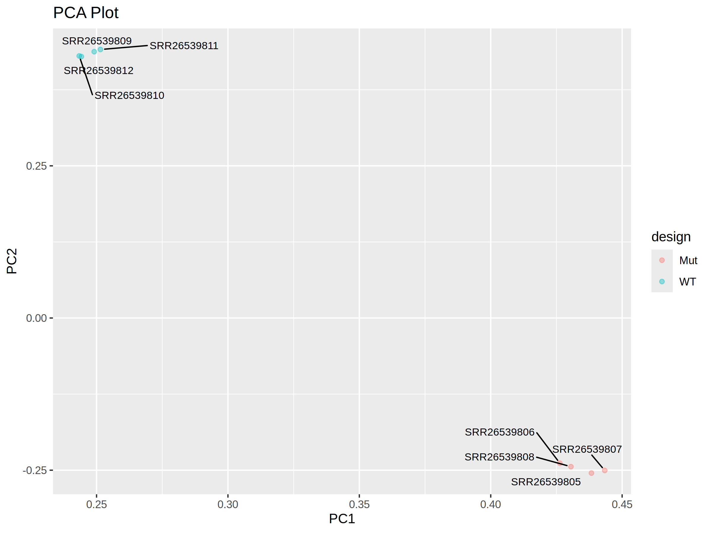

# 資料視覺化: 主成份分析

主成份分析是一種統計方法，用於簡化數據的維度，同時保留數據的主要變異性。在 RNA-seq 中，若每一個基因表現量代表 1 個維度，則 10 幾萬個基因就有 10 幾萬個維度。這在人類的理解以及製圖上太過複雜。因此，我們需要一個方法來將這個複雜維度簡化成 2 到 3 個維度，以便人類理解以及製圖。儘管維度被高度簡化，但是主要趨勢仍然保留。因此，我們可以用主成份分析 (Principal Component Analysis) 快速檢視 *重複樣本之間變異度* 以及 * 實驗組與對照組之間差異*

我們將使用 R 語言中的 ggplot2 套件來繪製主成份分析。主成份分析與前面 *資料視覺化: 火山圖* 一樣都是點圖的應用。因此在繪製上面大同小異。

## 快速上手

### 安裝 ggplot2 與 ggrepel 套件

```R
# Install and load necessary packages
install.packages("ggplot2")
install.packages("ggrepel")
```

### 載入套件
```R
library(ggplot2)
library(ggrepel)
```

### 檔案輸入

取讀在 *6.差異表現量統計* 中利用 stringtie 以及 prepDE.py3 產生序列讀序表格 gene_count_matrix.csv ，並且存入 table 的陣列。
```R
# read data from the read counts
table <- read.csv("gene_count_matrix.csv", header=TRUE)
table <- table[-1]
```
在計算 PCA 時，只能輸入純數值表格，因此我們將第一欄 (基因名) 稱去除 (`table <- table[-1]`)

### 創造 PCA 物件

1. 我們把 table 輸入進 `prcomp()` 函數，存入名叫 pca 的物件。
2. 讀取我們想要的 PCA 值，存入名為 pca_rotation 的陣列。
3. 新增名為 names 欄位，寫入樣本名。
4. 新增名為 design 欄位，標記實驗設計群組。
```R
# Perform PCA
pca <- prcomp(table)

# Extract PCA scores and annotation
pca_rotation <- data.frame(pca$rotation)
pca_rotation$names <- rownames(pca_rotation)
pca_rotation$design <- c("Mut","Mut","Mut","Mut","WT","WT","WT","WT")
```

### 繪製主成份分析

如同 *資料視覺化: 火山圖*，我們使用點圖繪製。 x 軸是 PC1，y 軸是 PC2。並使用多個渲染函式。其中，`geom_point()` 依照實驗群組的不同渲染不同點的實驗色。來源為 design 欄位; `geom_text_repel()` 標籤每個點的樣本名稱，名稱來源為 names 欄位。

```R
ggplot(pca_rotation, aes(x = PC1, y = PC2)) +
  geom_point(aes(colour=design),alpha=0.4) + 
  labs(x= "PC1", y= "PC2") +
  ggtitle("PCA Plot") +
  geom_text_repel(aes(label = names),
      size = 3,
      box.padding = unit(0.5, "lines"),
      point.padding = unit(0.3, "lines"))

# export the result
ggsave("pca_final.png", width = 8, height = 6, units = "in", dpi = 300)
```


這是一個品質很好的資料。我們可以很清楚看到，實驗組與對照組在不同的群集裡面。這代表實驗組與對照在的基因表現模式有很大的不同。另外，重複實驗之間的距離也很接近。這代表每個重複實驗基因表現模式雖不同但都相似。