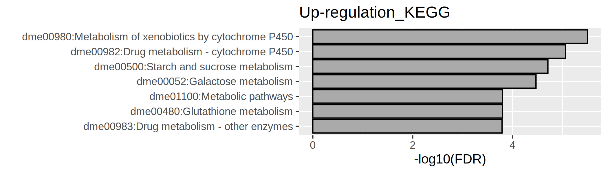
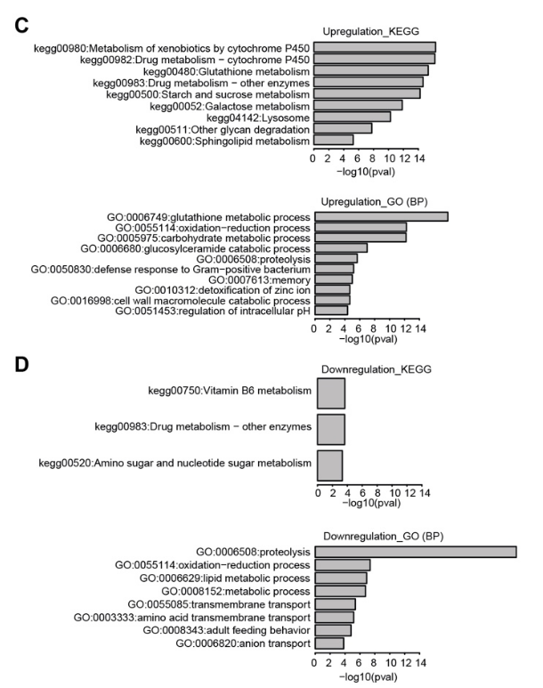

# Gene Ontology 分析 (GO analysis)

這個章節，我們要來找出哪些基因表現有顯著差異，以及用宏觀的方式來看看這些基因表現的改變了什麼生理現象。我們會先產生兩個名單，一個是顯著增加表現的基因名單，令一個是顯著減少表現的基因名單。然後再以這個名單來去查詢這些基因可能涉及的生理現象、或是訊息傳遞路徑。

本次示範由 R 語言來進行資料篩選與整理。

## 資料篩選

### 檔案輸入

取讀在 *6.差異表現量統計* 中利用 edgeR 產生差異表現表格 (以 "DEG.txt" 為例) 並且存入 dataset 這個陣列 (dataframe)。請依實際狀況修改檔案路徑。

```R
# Read DEG table
dataset <- read.delim("DEG.txt", header=TRUE)

# 在本例中，基因名稱以 "geneABC|geneABC" 顯示，這樣子的易讀性較差。因此，我使用下面的指令將基因名稱調整為 geneABC 形式
dataset$X <- gsub("\\|.*", "", dataset$X)
```

### 產生顯著基因名單

在此我們以 `subset()` 函數來進行篩選，並且設定，p-value < 0.05 and fold-change ≥ 1.2 為顯著差異的門檻。這樣產生的基因數量與原文文獻相似 (451 增加表現基因， 463 減少表現基因)
```R
# Set cutoff
cut_off_pvalue = 0.05

# 註: 2^0.585 ~= 1.5
cut_off_logFC = 0.585 

# up-regulated genes
up_gene <- subset(dataset, dataset$logFC >= cut_off_logFC & dataset$FDR <= cut_off_pvalue)

# down-regulated genes
dw_gene <- subset(dataset, dataset$logFC <= -cut_off_logFC & dataset$FDR <= cut_off_pvalue)

# 檢查產生篩選出多少基因
nrow(up_gene)
nrow(dw_gene)
```
結果共篩選出了 516 增加表現基因，414 減少表現基因
```
[1] 516
[1] 414
```

### 輸出表格
```R
write.table(up_gene$X, "DEG_up.name.txt", sep="\t",quote=F, row.names=F, col.names=F)
write.table(dw_gene$X, "DEG_dw.name.txt", sep="\t",quote=F, row.names=F, col.names=F)
```

## GO 分析

我們將前往 DAVID 頁面 https://david.ncifcrf.gov/tools.jsp ，使用網頁工具進行分析。

### 上傳名單


1. 按 Choose File 按鈕，上傳剛剛產生的名單 DEG_up.name.txt
2. 下拉式選單選擇我們的輸入類型為 OFFICIAL_GENE_SYMBOL
3. 輸入物種名稱 Drosophila melanogaster、選取清單類型 Gene List、送出 Submit List

重複此動作上傳 DEG_dw.name.txt

### 選擇數據進行分析


4. 送出後，在 List 分頁可以看到我們剛剛的上傳的清單。選取 DEG_up.name 
5. 按下 USE 開始分析
6. 過幾秒後，點選 Functional Annotion Tool

### 檢視與下載結果

**GO-BP (Biological processing)**


7. 選取 GOTERM_BP_DIRECT 列的 Chart 按鈕
8. 彈出 Biological Processing 相關，並且依照偽發現率 (Benjamini 法) 小到大排序。偽發現率越小則結果越可信。
9. 按 Download File 儲存結果。在這邊我命名為 up_GOBP.txt

**GO-KEGG (KEGG pathway)**


10. 與前面操作類似，選取 KEGG_PATHWAY 列的 Chart 按鈕
11. 彈出 KEGG PATHWAY 相關結果，並且依照偽發現率 (Benjamini 法) 小到大排序。偽發現率越小則結果越可信。接下來按 Download File 儲存結果。在這邊我命名為 up_KEGG.txt

接著選取另一個清單 DEG_dw.name 重複 5-11 的操作取得 dw_GOBP.txt 和 dw_KEGG.txt

## ggplot 呈現結果

接下來我們將使用 ggplot 的條狀圖來呈現 GO 分析的結果。

### 載入套件
```R
library(ggplot2)
```

### 條狀圖呈現 Up-regulation KEGG

檔案 I/O: 宣告輸入檔案名稱、標題、輸出檔案名稱
```R
INfile <- "up_GOKEGG.txt"
title <- "Up-regulation_KEGG"
OUT <- "Up-regulation_KEGG_bar.png"
```

讀取檔案，並且寫入 data 的陣列。用 `subset` 函數做篩選，保留 FDR 欄位數值小於 0.05
```R
data <- read.delim(INfile, header = TRUE)
data <- subset(data, FDR <= 0.05)
```

ggplot 繪製。

底圖部份 `ggplot()`：x 軸為顯示 -log10(FDR)，來源為 FDR 欄位。Y 軸顯示 GO term，來源 Term 欄位。值得注意的是為了更好呈現數據，我用 `reoder` 函數排序 GO term 依照 FDR 值由小排到大。

條狀圖渲染 `geom_bar()` ，設置 `stat = "identity"` 代表每一條的長度將等於對應 y 軸的變數值（在這邊是指 FDR。此外我還指定邊框顏色 `color` 跟長條的填充顏色 `fill`。顏色可以用英文或是 16 進位色碼表示。除此之外，我還對於 x y 軸與名稱渲染 `labs()`。完成繪圖後輸出圖檔 `ggsave`。

```R
ggplot(data, aes(x = -log10(FDR), y = reorder(Term, FDR, decreasing = TRUE))) + 
    geom_bar(stat = "identity", color = "black", fill = "#AAAAAA") +
    labs(x = "-log10(FDR)", y = "", title = title)
  
ggsave(OUT, width = 7, height = 2, units = "in", dpi = 300)
```


### 自訂函數

我們可以用相同手法產生其他長條圖。由於都是差不多的操作。我們可以將這些指令包裝成一個自訂函數。我們只需要置換輸入檔案名稱與標題名稱，就可以輕鬆操作。這個一個可靠且有效率的方法，避免我們漏改輸入或是輸出名稱。

以下是自訂函數
```R
generate_barplot <- function(INfile, title) {
  OUT <- paste0(title, "_bar.png")
  data <- read.delim(INfile, header = TRUE)
  data <- subset(data, FDR <= 0.05)
  
  ggplot(data, aes(x = -log10(FDR), y = reorder(Term, FDR, decreasing = TRUE))) + 
    geom_bar(stat = "identity", color = "black", fill = "#AAAAAA") +
    labs(x = "-log10(FDR)", y = "", title = title)
  
  ggsave(OUT, width = 7, height = 2, units = "in", dpi = 300)
}
```

### 用自訂函數繪製長條圖來呈現 Up-regulation GO (BP)
```R
INfile <- "up_GOBP.txt"
title <- "Up-regulation_GO_BP"
generate_barplot(INfile, title)
```


### 用自訂函數繪製長條圖來呈現 Down-regulation KEGG
```R
INfile <- "dw_GOKEGG.txt"
title <- "Down-regulation_KEGG"
generate_barplot(INfile, title)
```


糟糕，一片空白，這表示我們沒有找到足夠可靠的 KEGG 路徑。這很常見，當輸入的基因清單結果太小的時候或是實驗組與對照組的基因差異不大時，會有這種情況。我們可以降低篩選標準 (例如 FDR < 0.1) ，或是降低顯著基因表現的門檻 (例如: FDR < 0.1, fold change 1.2) 等等作法。或是，什麼都不做。沒有就是沒有。沒有必要刑求數據。

### 用自訂函數繪製長條圖來呈現 Down-regulation GO (BP)
```R
INfile <- "dw_GOBP.txt"
title <- "Down-regulation_GO_BP"
generate_barplot(INfile, title)
```


### 對比原始文獻的結果

雖然我們採用與原始文獻不同的分析工具，但是整體來說，我們得到大致一樣的結論。這說明我們兩邊的分析方法的發現是可以被相互驗證的。



出處 [Drosophila as a model for studying cystic fibrosis pathophysiology of the gastrointestinal system](https://pubmed.ncbi.nlm.nih.gov/32345720/)